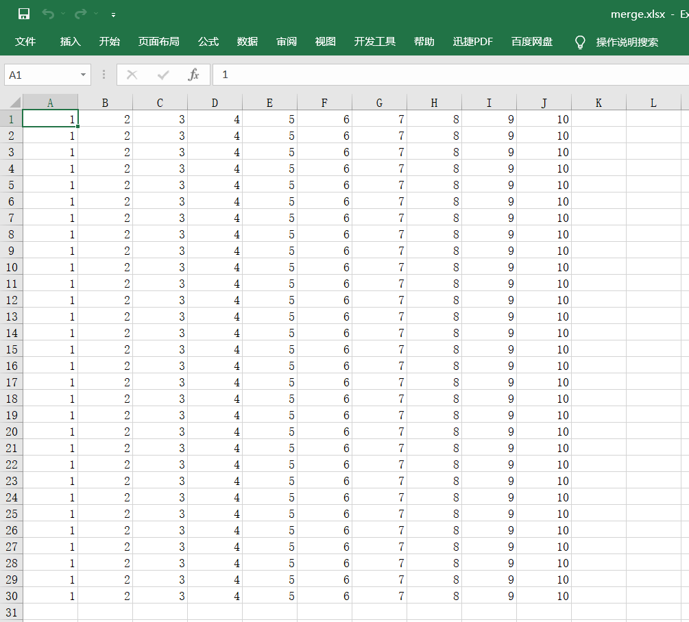

## python 合并多个excel文件


### 使用 openpyxl


**思路：**

- 读取n个excel的文件，存储在一个二维数组中，注意需要转置。
- 将二维数组的数据写入excel。


安装软件：

```shell
pip install openpyxl
```


**源代码：**

```python
import os
import openpyxl
# 将n个excel文件数据合并到一个excel


# 读取n个excel文件数据，并且合并到一个二维数组，每个excel只读取A列，且行数保持一样
def merge(n):
    data = []
    for i in range(n):
        data_file_path = os.path.join('data', f'data{i + 1}.xlsx')
        # 返回一个workbook数据类型的值
        workbook = openpyxl.load_workbook(data_file_path)
        sheet = workbook.active
        # 取A列数据
        cell = sheet['A']
        column = []
        for j in cell:
            column.append(j.value)
        data.append(column)

    # print(data)
    # 转置
    transpose_data = list(map(list, zip(*data)))
    # print(transpose_data)
    merge_file_path = os.path.join('data', 'merge.xlsx')
    save(transpose_data, merge_file_path)


# 将二维数据数据保存到excel文件
def save(data, file_path):
    workbook = openpyxl.Workbook()
    sheet = workbook.active
    sheet.title = 'Sheet1'
    workbook.save(file_path)

    for row in data:
        sheet.append(row)
    workbook.save(file_path)


if __name__ == '__main__':
    merge(10)

```


效果截图：




### 使用 pandas

待补充


### 参考

- https://zhuanlan.zhihu.com/p/353669230
- https://blog.csdn.net/weixin_44288604/article/details/120731317
- [二维数组转置](https://www.cnblogs.com/MoonYear530/p/13697120.html)


### 源代码位置：

https://github.com/YoungBear/MachineLearning/blob/master/com/ysx/example/excel/openpyxl/merge_excel.py

